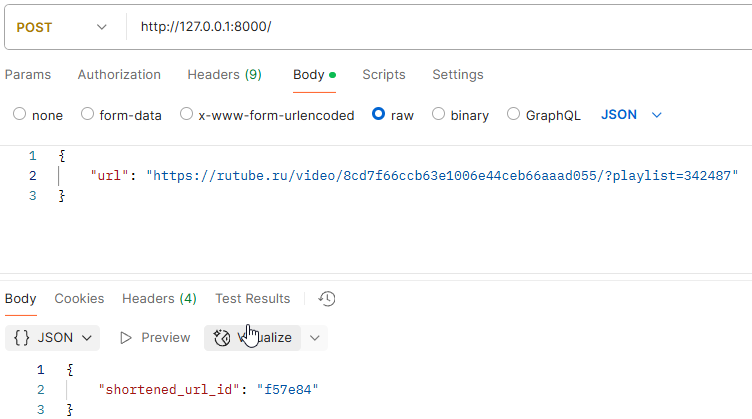
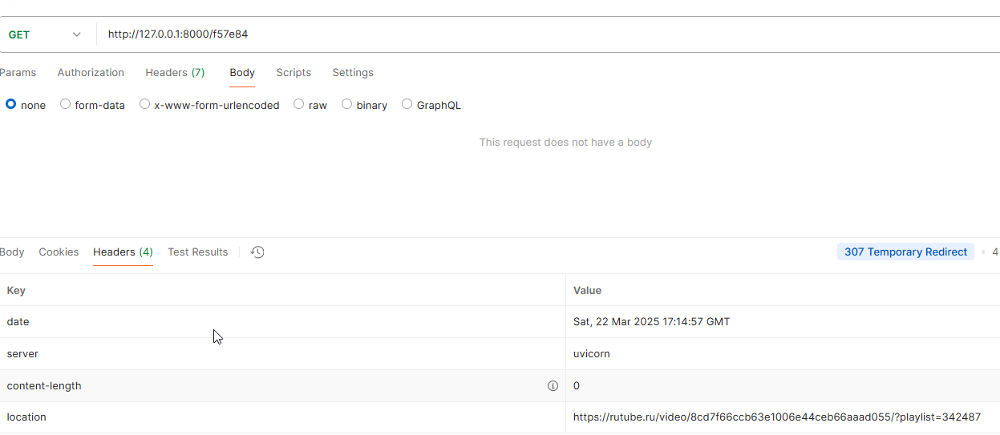

### A service for shortening URLs and further redirection to the shortened link.
#### Libraries: Python 3.12, FastAPI, uvicorn, httpx, flake8
Launch instructions:
1. install and run docker
2. build container and run app -> docker compose up --build
3. Try POST-request long url:
- Post request long URL

- Response short_url for redirect to original address (Location)

